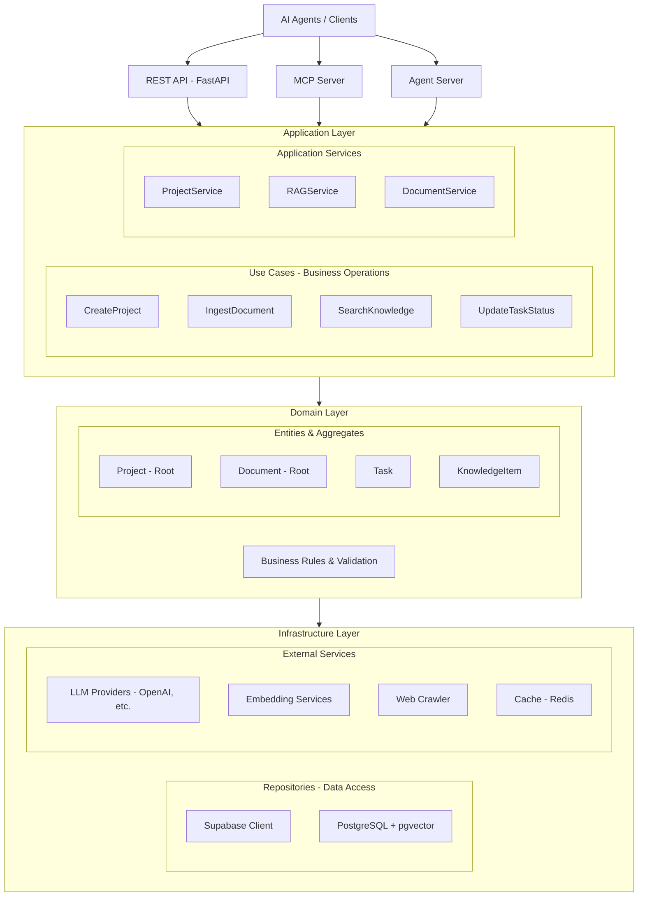

# Contextiva - Knowledge Engine for AI Agents

<div align="center">


**Empower AI Agents with Contextual Knowledge**

[](https://www.python.org/downloads/)
[](https://fastapi.tiangolo.com/)
[](https://opensource.org/licenses/MIT)

[Features](#features) • [Quick Start](#quick-start) • [Documentation](/docs/) • [Contributing](#contributing)

</div>

---
> Status: This project is under active development. Interfaces, schemas, and docs may change frequently until the initial stable release.
<div style="text-align: justify;">

## 🎯 Overview

**Contextiva** is a modern, production-ready knowledge engine designed specifically for AI agents. It provides intelligent document management, semantic search, and contextual retrieval capabilities through a clean REST API and Model Context Protocol (MCP) integration.

Built on Domain-Driven Design principles, Contextiva enables AI agents to:
- 📚 **Manage Projects** - Organize knowledge hierarchically
- 📄 **Process Documents** - Ingest and version technical documentation
- 🔍 **Semantic Search** - Find relevant information using RAG (Retrieval-Augmented Generation)
- 🤖 **Agent Integration** - Seamlessly connect with AI agents via MCP
- 🧠 **Contextual Understanding** - Leverage advanced embedding techniques for better comprehension

## ✨ Features

### Core Capabilities

#### 🗂️ **Project Management**
- Create and organize knowledge projects
- GitHub repository integration
- Hierarchical feature tracking
- Status management (Active, Archived)
- Tag-based organization

#### 📑 **Document Management**
- Multiple document types (PRD, Architecture, API, Technical Specs)
- Version control with semantic versioning
- Rich content structure with metadata
- Automatic extraction and processing
- Support for various formats (Markdown, PDF, DOCX, HTML)

#### 🎯 **Task Management**
- Project-scoped task tracking
- Priority and status management
- Assignee support
- Dependency tracking
- Due date management

#### 🔎 **Advanced RAG System**
- **Semantic Search**: Vector similarity using embeddings
- **Hybrid Search**: Combines semantic and keyword-based retrieval
- **Contextual Embeddings**: Enhanced understanding using surrounding context
- **Re-ranking**: Improves result relevance
- **Agentic RAG**: AI-powered query understanding and result synthesis
- **Multi-modal Support**: Text, code, and structured data

#### 🔌 **Flexible LLM Integration**
- **OpenAI**: GPT-4, GPT-3.5-turbo
- **Anthropic**: Claude 3 (Opus, Sonnet, Haiku)
- **Ollama**: Local LLM deployment
- **OpenRouter**: Access to 100+ models
- **Custom Providers**: Easy to add new providers

#### 🌐 **Web Crawling & Ingestion**
- Automated documentation crawling
- URL-based knowledge ingestion
- Sitemap support
- Content extraction and cleaning
- Metadata preservation

### Technical Excellence

#### 🏗️ **Architecture**
- **Clean Architecture**: Separation of concerns across layers
- **Domain-Driven Design**: Rich domain models with business logic
- **SOLID Principles**: Maintainable and extensible codebase
- **Repository Pattern**: Abstracted data access
- **Dependency Injection**: Loose coupling throughout

#### 🚀 **Performance**
- **Async/Await**: Non-blocking I/O operations
- **Connection Pooling**: Efficient database connections
- **Redis Caching**: Fast repeated queries
- **Batch Processing**: Optimized bulk operations
- **Pagination**: Memory-efficient data retrieval

#### 🔒 **Security**
- **Authentication**: JWT token support
- **Authorization**: Role-based access control
- **Input Validation**: Pydantic schema validation
- **SQL Injection Protection**: Parameterized queries
- **Rate Limiting**: API throttling
- **CORS**: Configurable cross-origin policies

#### 📊 **Observability**
- **Structured Logging**: JSON-formatted logs
- **Request Tracing**: End-to-end request tracking
- **Error Tracking**: Comprehensive error reporting
- **Performance Metrics**: Response time monitoring
- **Health Checks**: Service status endpoints

## 🚀 Quick Start

### Prerequisites

- Python 3.11 or higher
- Poetry (package manager)
- Supabase account (or PostgreSQL with pgvector)
- OpenAI API key (or alternative LLM provider)

### Installation

1. **Clone the repository**
```bash
git clone https://github.com/yourusername/contextiva.git
cd contextiva
```

2. **Install dependencies (optional)**
   - If you develop locally with Poetry and Python 3.11:
   ```bash
   poetry install
   ```

3. **Configure environment**
```bash
cp .env.example .env
# Edit .env with your configuration
```

4. **Run with Docker (Recommended for local)**
```bash
# Start Postgres (pgvector) and Redis on a shared network
docker network create contextiva-net || true
docker run -d --name contextiva-postgres --network contextiva-net \
  -e POSTGRES_DB=contextiva -e POSTGRES_USER=tumblrs -e POSTGRES_PASSWORD='Saran@2004' ankane/pgvector:latest
docker run -d --name contextiva-redis --network contextiva-net redis:7

# Apply migrations (reads env when provided)
docker run --rm --network contextiva-net -v "$PWD":"/app" -w /app \
  -e POSTGRES_HOST=contextiva-postgres -e POSTGRES_PORT=5432 \
  -e POSTGRES_DB=contextiva -e POSTGRES_USER=tumblrs -e POSTGRES_PASSWORD='Saran@2004' \
  python:3.11 bash -lc "pip install --quiet alembic psycopg2-binary sqlalchemy && alembic upgrade head"

# Start API for development (mounts code)
docker run -d --name contextiva-api --network contextiva-net -p 8000:8000 \
  -e APP_ENV=local -e APP_HOST=0.0.0.0 -e APP_PORT=8000 \
  -e POSTGRES_HOST=contextiva-postgres -e POSTGRES_PORT=5432 \
  -e POSTGRES_DB=contextiva -e POSTGRES_USER=tumblrs -e POSTGRES_PASSWORD='Saran@2004' \
  -e REDIS_HOST=contextiva-redis -e REDIS_PORT=6379 -e REDIS_DB=0 \
  -v "$PWD":"/app" -w /app \
  python:3.11 bash -lc "pip install --quiet fastapi uvicorn asyncpg redis 'python-jose[cryptography]' 'passlib[bcrypt]' pydantic && uvicorn src.api.main:app --host 0.0.0.0 --port 8000"
```

5. **Start the server (Local/Poetry option)**
```bash
# Use this only if running without Docker
poetry run uvicorn src.api.main:app --reload --port 8000
```

6. **Access the API**
```
http://localhost:8000/api/docs
```

### Docker Deployment (Compose)

```bash
# Build and run all services
docker-compose up -d

# View logs
docker-compose logs -f

# Stop services
docker-compose down
```

## 📖 Documentation

### API Endpoints

#### Projects
```http
POST   /api/v1/projects          # Create project
GET    /api/v1/projects          # List projects
GET    /api/v1/projects/{id}     # Get project
PUT    /api/v1/projects/{id}     # Update project
DELETE /api/v1/projects/{id}     # Delete project
POST   /api/v1/projects/{id}/archive  # Archive project
```

#### Documents
```http
POST   /api/v1/documents         # Create document
GET    /api/v1/documents         # List documents
GET    /api/v1/documents/{id}    # Get document
PUT    /api/v1/documents/{id}    # Update document
DELETE /api/v1/documents/{id}    # Delete document
POST   /api/v1/documents/{id}/version  # Create new version
```

#### Tasks
```http
POST   /api/v1/tasks             # Create task
GET    /api/v1/tasks             # List tasks
GET    /api/v1/tasks/{id}        # Get task
PUT    /api/v1/tasks/{id}        # Update task
DELETE /api/v1/tasks/{id}        # Delete task
PUT    /api/v1/tasks/{id}/status # Update status
```

#### RAG & Search
```http
POST   /api/v1/rag/query         # Semantic search
POST   /api/v1/rag/ingest        # Ingest documents
GET    /api/v1/rag/sources       # List knowledge sources
POST   /api/v1/knowledge/crawl   # Crawl URL
POST   /api/v1/knowledge/upload  # Upload file
```

### Configuration

#### Environment Variables (Backend)

```bash
# Application
APP_ENV=local
APP_HOST=0.0.0.0
APP_PORT=8000

# Database (used by app and Alembic migrations)
POSTGRES_HOST=localhost
POSTGRES_PORT=5432
POSTGRES_DB=contextiva
POSTGRES_USER=your-user
POSTGRES_PASSWORD=your-password

# LLM Provider
LLM_PROVIDER=openai  # openai, anthropic, ollama, openrouter
LLM_API_KEY=sk-...
LLM_MODEL=gpt-4o-mini
LLM_TEMPERATURE=0.3
LLM_MAX_TOKENS=2000

# Embeddings
EMBEDDING_PROVIDER=openai
EMBEDDING_MODEL=text-embedding-3-small
EMBEDDING_DIMENSIONS=1536
EMBEDDING_USE_CONTEXTUAL=false

# RAG Configuration
RAG_CHUNK_SIZE=5000
RAG_CHUNK_OVERLAP=200
RAG_MATCH_COUNT=5
RAG_SIMILARITY_THRESHOLD=0.05
RAG_USE_HYBRID_SEARCH=false
RAG_USE_RERANKING=false
RAG_USE_AGENTIC=false

# Cache (Optional)
CACHE_ENABLED=true
CACHE_REDIS_URL=redis://localhost:6379
CACHE_TTL=3600

# Observability
OBS_LOG_LEVEL=INFO
OBS_LOGFIRE_ENABLED=false
OBS_LOGFIRE_TOKEN=your-token

# CORS (optional)
API_CORS_ORIGINS=["*"]
```

## 🏛️ Architecture

### System Design



## 🔧 Development

### Current Implementation Status
- Story 1.1 (Foundation & Scaffolding): COMPLETE
  - FastAPI app at `/api/docs`, health endpoint `/api/v1/health`
  - Clean Architecture skeleton in `src/`
  - Poetry project with lint/format/type-check tooling
- Story 1.2 (DB & Observability): COMPLETE
  - `asyncpg` connection pool with ping
  - Alembic baseline + pgvector extension migration
  - JSON structured logging and request logging middleware (request id, duration)
  - Health endpoint validates DB connectivity

### Setup Development Environment

```bash
# Install pre-commit hooks
poetry run pre-commit install

# Run linter
poetry run ruff check src/

# Format code
poetry run black src/

# Type checking
poetry run mypy src/
```

### Running Tests

```bash
# All tests
poetry run pytest

# With coverage
poetry run pytest --cov=src --cov-report=html

# Specific test suite
poetry run pytest tests/unit/
poetry run pytest tests/integration/
poetry run pytest tests/e2e/
```

### Database Migrations

```bash
# Create migration
poetry run alembic revision --autogenerate -m "description"

# Apply migrations
poetry run alembic upgrade head

# Rollback
poetry run alembic downgrade -1
```

## 📊 Performance

### Benchmarks (Dummy values)

| Operation | Throughput | Latency (p95) |
|-----------|-----------|---------------|
| Create Project | 500 req/s | 45ms |
| Get Project | 2000 req/s | 15ms |
| Semantic Search | 100 req/s | 250ms |
| Document Ingest | 50 req/s | 1.2s |

### Optimization Tips

1. **Enable Caching**: Set `CACHE_ENABLED=true`
2. **Use Hybrid Search**: Better performance than pure semantic
3. **Batch Operations**: Use bulk endpoints for multiple items
4. **Connection Pooling**: Configure appropriate pool size
5. **Pagination**: Always use pagination for large datasets

## 🔐 Security

### Best Practices

1. **API Keys**: Store in environment variables, never in code
2. **Authentication**: Implement JWT tokens for production
3. **Rate Limiting**: Configure appropriate limits
4. **Input Validation**: All inputs are validated with Pydantic
5. **SQL Injection**: Protected by parameterized queries
6. **CORS**: Configure specific origins in production

### Security Checklist

- [ ] Change default credentials
- [ ] Enable HTTPS in production
- [ ] Configure firewall rules
- [ ] Set up API rate limiting
- [ ] Enable audit logging
- [ ] Regular security updates
- [ ] Implement authentication
- [ ] Use secrets management

## 🚢 Deployment

### Docker

```bash
# Build image
docker build -t contextiva:latest .

# Run container
docker run -p 8000:8000 \
  --env-file .env \
  contextiva:latest
```

### Docker Compose (Recommended)

```bash
# Start all services
docker-compose up -d

# Scale API service
docker-compose up -d --scale api=3

# View logs
docker-compose logs -f api
```

### Kubernetes

```bash
# Apply configurations
kubectl apply -f k8s/

# Check status
kubectl get pods -n contextiva

# Scale deployment
kubectl scale deployment contextiva-api --replicas=5
```

### Cloud Platforms

#### AWS
- Use ECS/EKS for container orchestration
- RDS for PostgreSQL
- ElastiCache for Redis
- API Gateway for routing

#### GCP
- Use Cloud Run or GKE
- Cloud SQL for PostgreSQL
- Memorystore for Redis
- Cloud Load Balancing

#### Azure
- Azure Container Instances or AKS
- Azure Database for PostgreSQL
- Azure Cache for Redis
- Application Gateway

## 🤝 Contributing

We welcome contributions! Please see our [Contributing Guide](CONTRIBUTING.md) for details.

### Development Workflow

1. Fork the repository
2. Create a feature branch (`git checkout -b feature/amazing-feature`)
3. Make your changes
4. Run tests (`poetry run pytest`)
5. Commit your changes (`git commit -m 'Add amazing feature'`)
6. Push to the branch (`git push origin feature/amazing-feature`)
7. Open a Pull Request

### Code Style

- Follow PEP 8 guidelines
- Use type hints
- Write docstrings (Google style)
- Add tests for new features
- Keep functions focused and small

## 📝 License

This project is licensed under the MIT License - see the [LICENSE](LICENSE) file for details.

## 🙏 Acknowledgments

- **FastAPI** - Modern web framework
- **Pydantic** - Data validation
- **Supabase** - Backend infrastructure
- **LangChain** - LLM orchestration concepts
- **OpenAI** - Embeddings and LLM capabilities

## 📞 Support

- **Documentation**: [docs.contextiva.dev](https://docs.contextiva.dev)
- **Issues**: [GitHub Issues](https://github.com/yourusername/contextiva/issues)
- **Discussions**: [GitHub Discussions](https://github.com/yourusername/contextiva/discussions)
- **Email**: support@contextiva.dev

## 🗺️ Roadmap

### Version 2.1 (Q1 2025)
- [ ] GraphQL API
- [ ] Real-time updates (WebSocket)
- [ ] Advanced analytics dashboard
- [ ] Multi-tenant support

### Version 2.2 (Q2 2025)
- [ ] Event sourcing implementation
- [ ] CQRS pattern
- [ ] Distributed tracing
- [ ] Advanced RAG strategies

### Version 3.0 (Q3 2025)
- [ ] Microservices architecture
- [ ] Service mesh integration
- [ ] Multi-modal RAG (images, audio)
- [ ] Agent marketplace

### In Progress / Next
- Security & Auth Foundation (Story 1.4): JWT issue & verify, RBAC stubs, auth dependency
- Project Management API (Story 1.5): CRUD endpoints + E2E tests

### Future Enhancements
- Knowledge ingestion pipelines (file upload, crawling) with embeddings
- Advanced RAG: hybrid search, reranking, agentic synthesis
- MCP server for agent integration

</div>

---

<div align="center">

**Built with ❤️ for the AI Agent community**

[Website](https://contextiva.dev) • [Documentation](https://docs.contextiva.dev) • [Blog](https://blog.contextiva.dev)

</div>