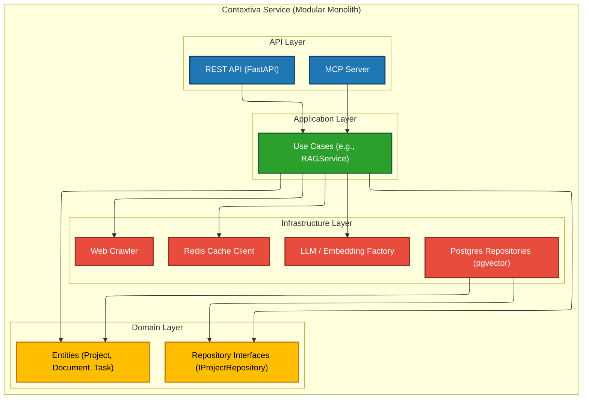

# Components
The architecture is divided into four primary logical components (layers) as dictated by Clean Architecture. All dependencies flow inwards, with the Domain Layer at the center, having no dependencies on any other layer.

## Component-list
1. **API Layer (FastAPI)**
- **Responsibility**: Handles all external communication. This includes receiving HTTP requests (REST API) and MCP connections, validating incoming data (Pydantic), enforcing security (JWT/RBAC), and mapping requests to the Application Layer. It contains no business logic.
- **Key Interfaces**: Exposes all REST endpoints (e.g., POST /api/v1/projects) and the MCP Server.
- **Dependencies**: Application Layer.
- **Technology Stack**: FastAPI, Pydantic, python-jose.
2. **Application Layer (Use Cases)**
- **Responsibility**: Orchestrates the execution of business logic. This layer contains the specific use cases (e.g., CreateProjectUseCase, SearchKnowledgeUseCase, IngestDocumentUseCase). It coordinates the Domain Layer entities and the Infrastructure Layer interfaces to perform tasks.
- **Key Interfaces**: Exposes use case classes/functions (e.g., CreateProjectUseCase.execute(...)).
- **Dependencies**: Domain Layer (to use entities and repository interfaces).
- **Technology Stack**: Plain Python.
3. **Domain Layer (Entities & Rules)**
- **Responsibility**: Contains all core business logic, models, and rules. This is the heart of the application. It defines the entities (Project, Document, Task, KnowledgeItem) and the abstract repository interfaces (IProjectRepository, IDocumentRepository, etc.).
- **Key Interfaces**: Exposes the domain entities and the repository interfaces.
- **Dependencies**: None. This layer is fully isolated.
- **Technology Stack**: Plain Python, Pydantic (for value objects).
4. **Infrastructure Layer (Implementation)**
- **Responsibility**: Implements all interactions with the "outside world." This includes concrete implementations of the repository interfaces (e.g., PostgresProjectRepository), the LLM/Embedding Provider Factory, the Redis cache client, and the Web Crawler.
- **Key Interfaces**: Implements the IRepository interfaces defined in the Domain Layer.
- **Dependencies**: Domain Layer (to implement interfaces), external libraries (e.g., asyncpg, redis, openai, httpx).
- **Technology Stack**: asyncpg, redis, httpx, openai, anthropic, ollama, BeautifulSoup.

## Component Diagrams
This diagram illustrates the logical components within the "Contextiva Service" and their primary dependencies, following the Clean Architecture model.

