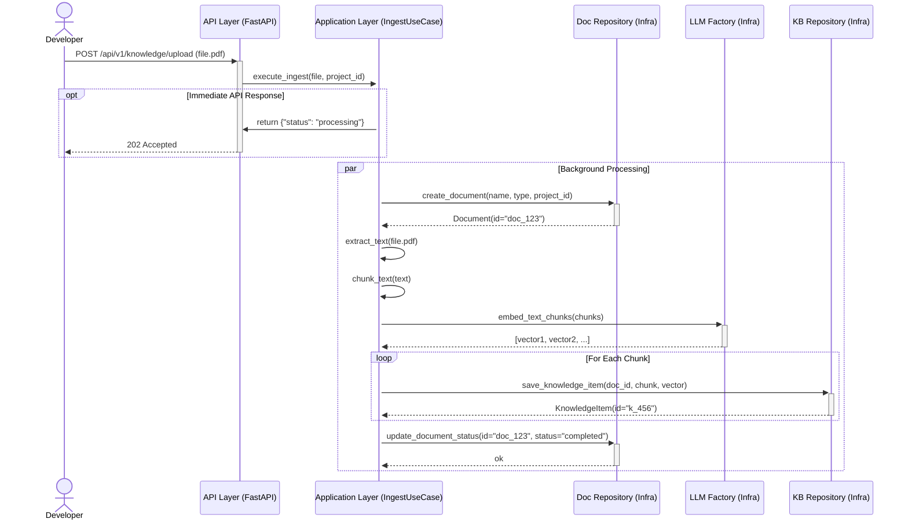
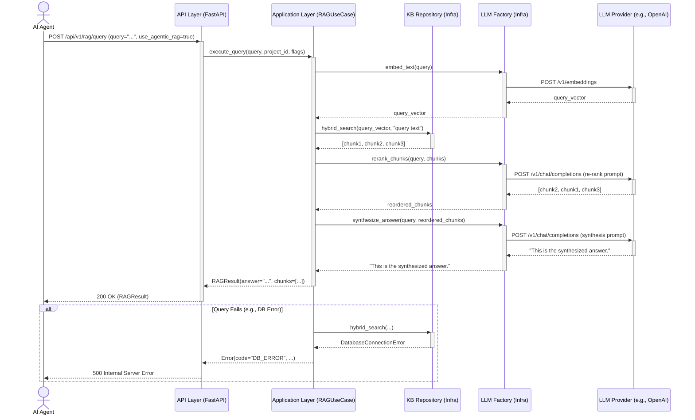

# Core Workflows

## Workflow 1: Knowledge Ingestion (File Upload)
This diagram illustrates the asynchronous process for ingesting a new document, as defined in PRD Story 2.5. The API returns an immediate acknowledgment while processing, chunking, and embedding happen in the background.

## Workflow 2: Knowledge Retrieval (Agentic RAG Query)
This diagram illustrates the full end-to-end "Agentic RAG" query, as defined in PRD Story 3.3. It includes retrieval, re-ranking, and final synthesis, as well as a basic error path.

