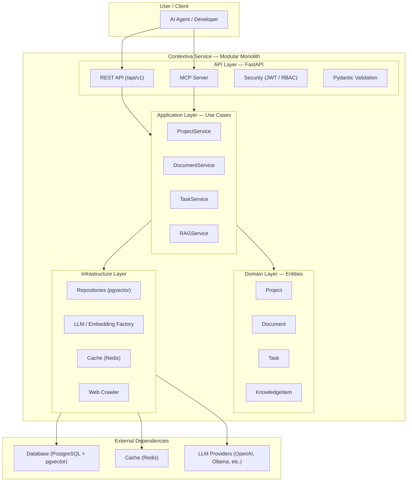

# High Level Architecture

## Technical Summary
This architecture establishes a Modular Monolith for the Contextiva service, built on Clean Architecture and Domain-Driven Design (DDD) principles. The system is a single, containerized FastAPI application with clear separation of concerns into Infrastructure, Domain, Application, and API layers. Key components include a pluggable LLM/Embedding Factory, a persistent data layer using PostgreSQL with pgvector , and a Redis cache for performance. This approach directly supports the PRD goals by providing a robust, testable, and maintainable foundation that is secure and built for high-performance async operations.

## High Level Overview
1. **Architectural Style**: The primary style is a Modular Monolith implementing Clean Architecture. This is a direct implementation of the PRD's "Technical Assumptions" (NFR1, NFR11). The core business logic (Domain layer) is independent of all external frameworks and dependencies (Infrastructure layer).
2. **Repository Structure**: A Monorepo structure is used, as defined in the PRD "Technical Assumptions". This will contain the single src/ directory for the application, along with docs/, migration/, tests/, etc., allowing for easy sharing of domain models and DTOs.
3. **Service Architecture**: The service architecture is a single FastAPI application. Data flow is unidirectional and controlled by the principles of Clean Architecture:
        -The API Layer (FastAPI routers) receives HTTP requests and calls the...
        - Application Layer (Use Cases/Services), which orchestrates the...
        - Domain Layer (Entities/Business Rules), which are persisted by the...
        - Infrastructure Layer (Repositories/External Services).
4. **Data Flow**: A typical "query" flow: An AI Agent (Client) sends a JWT-authenticated REST request to the API Layer. The API layer calls the SearchKnowledgeUseCase (Application Layer). The use case coordinates the IKnowledgeRepository (Infrastructure Layer) to fetch relevant chunks from the PostgreSQL/pgvector database and the ILLMProvider (Infrastructure Layer) to synthesize an answer. The result is returned up the chain to the client.

## High Level Project Diagram

## Architectural and Design Patterns
- **Clean Architecture**: This is the foundational pattern, mandated by the PRD (NFR1). It ensures separation of concerns, testability, and independence from frameworks.
        - **Rationale**: Aligns with the goal of a robust, maintainable, and production-ready system.
- **Domain-Driven Design** (DDD): Used to model the complex business logic of Projects, Documents, and Tasks. We will use Entities, Aggregates (e.g., Project as an aggregate root), and Value Objects.
        - **Rationale**: Directly supports the PRD's vision of a rich domain model that understands "Projects" and "Documents," not just vector chunks.
- **Repository Pattern**: Used to abstract all data access. The Application layer will depend on interfaces (e.g., IProjectRepository) defined in the Domain layer, with concrete implementations (e.g., PostgresProjectRepository) in the Infrastructure layer.
        - **Rationale**: Enforces Clean Architecture, makes the system testable (by mocking repositories), and allows for future database changes without affecting business logic.
- **Factory Pattern**: Used for the LLM & Embedding providers, as mandated by the PRD (NFR8).
        - **Rationale**: Provides the required pluggable extensibility, allowing users to switch providers via configuration.
- **Dependency Injection**: We will leverage FastAPI's built-in dependency injection system to provide services, repositories, and configurations to the API and Application layers.
        - **Rationale**: Manages dependencies cleanly and simplifies testing.
