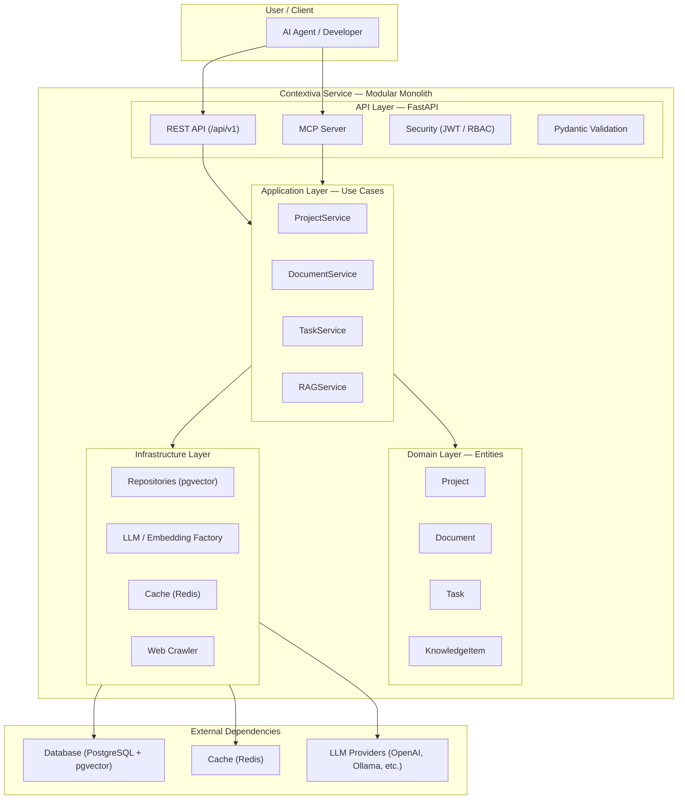
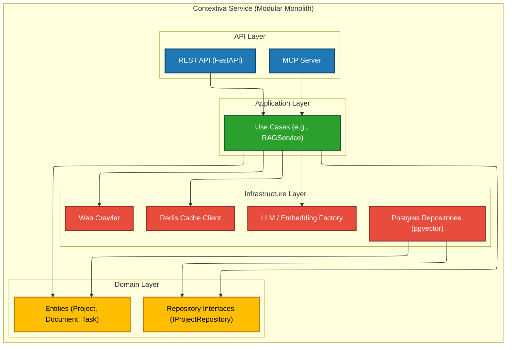
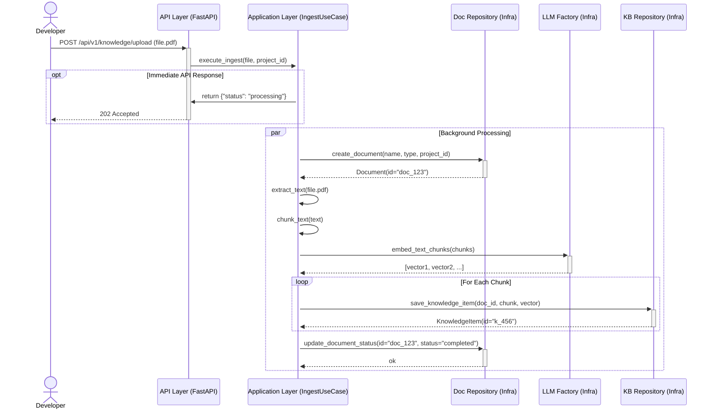
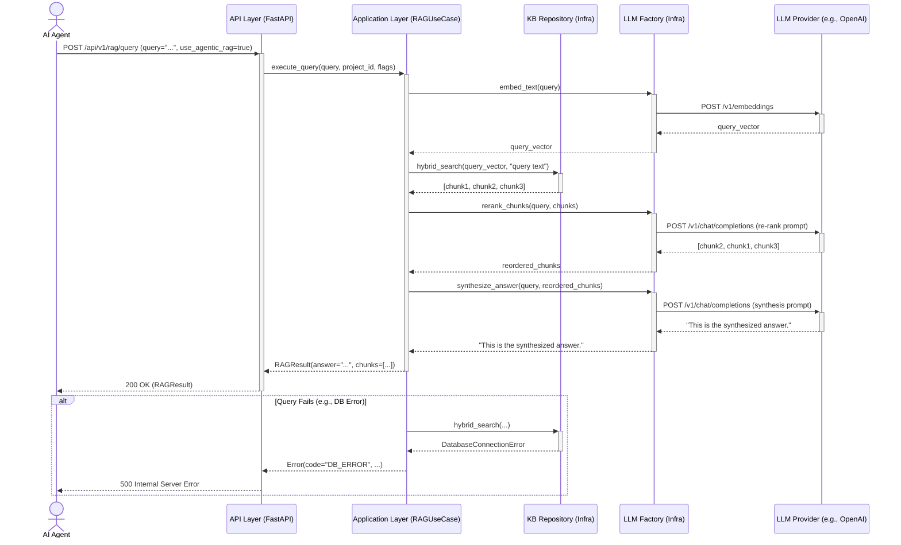

<div style="text-align: justify;">

# Contextiva Architecture Document

## Introduction
This document outlines the overall project architecture for Contextiva, including backend systems, shared services, and non-UI specific concerns. Its primary goal is to serve as the guiding architectural blueprint for AI-driven development, ensuring consistency and adherence to chosen patterns and technologies.

### Starter Template or Existing Project
**Status**: N/A - Greenfield project.

The architecture will be built from scratch.

The foundational scaffolding, including the Clean Architecture directory structure, core dependencies, Docker configuration, and database setup, will be created as part of PRD Epic 1, Story 1.1 ("Project Foundation & Scaffolding"). No external starter template will be used.

## High Level Architecture

### Technical Summary
This architecture establishes a Modular Monolith for the Contextiva service, built on Clean Architecture and Domain-Driven Design (DDD) principles. The system is a single, containerized FastAPI application with clear separation of concerns into Infrastructure, Domain, Application, and API layers. Key components include a pluggable LLM/Embedding Factory, a persistent data layer using PostgreSQL with pgvector , and a Redis cache for performance. This approach directly supports the PRD goals by providing a robust, testable, and maintainable foundation that is secure and built for high-performance async operations.

### High Level Overview
1. **Architectural Style**: The primary style is a Modular Monolith implementing Clean Architecture. This is a direct implementation of the PRD's "Technical Assumptions" (NFR1, NFR11). The core business logic (Domain layer) is independent of all external frameworks and dependencies (Infrastructure layer).
2. **Repository Structure**: A Monorepo structure is used, as defined in the PRD "Technical Assumptions". This will contain the single src/ directory for the application, along with docs/, migration/, tests/, etc., allowing for easy sharing of domain models and DTOs.
3. **Service Architecture**: The service architecture is a single FastAPI application. Data flow is unidirectional and controlled by the principles of Clean Architecture:
        -The API Layer (FastAPI routers) receives HTTP requests and calls the...
        - Application Layer (Use Cases/Services), which orchestrates the...
        - Domain Layer (Entities/Business Rules), which are persisted by the...
        - Infrastructure Layer (Repositories/External Services).
4. **Data Flow**: A typical "query" flow: An AI Agent (Client) sends a JWT-authenticated REST request to the API Layer. The API layer calls the SearchKnowledgeUseCase (Application Layer). The use case coordinates the IKnowledgeRepository (Infrastructure Layer) to fetch relevant chunks from the PostgreSQL/pgvector database and the ILLMProvider (Infrastructure Layer) to synthesize an answer. The result is returned up the chain to the client.

### High Level Project Diagram


### Architectural and Design Patterns
- **Clean Architecture**: This is the foundational pattern, mandated by the PRD (NFR1). It ensures separation of concerns, testability, and independence from frameworks.
        - **Rationale**: Aligns with the goal of a robust, maintainable, and production-ready system.
- **Domain-Driven Design** (DDD): Used to model the complex business logic of Projects, Documents, and Tasks. We will use Entities, Aggregates (e.g., Project as an aggregate root), and Value Objects.
        - **Rationale**: Directly supports the PRD's vision of a rich domain model that understands "Projects" and "Documents," not just vector chunks.
- **Repository Pattern**: Used to abstract all data access. The Application layer will depend on interfaces (e.g., IProjectRepository) defined in the Domain layer, with concrete implementations (e.g., PostgresProjectRepository) in the Infrastructure layer.
        - **Rationale**: Enforces Clean Architecture, makes the system testable (by mocking repositories), and allows for future database changes without affecting business logic.
- **Factory Pattern**: Used for the LLM & Embedding providers, as mandated by the PRD (NFR8).
        - **Rationale**: Provides the required pluggable extensibility, allowing users to switch providers via configuration.
- **Dependency Injection**: We will leverage FastAPI's built-in dependency injection system to provide services, repositories, and configurations to the API and Application layers.
        - **Rationale**: Manages dependencies cleanly and simplifies testing.

## Tech Stack

### Cloud Infrastructure
- **Provider**: Supabase (or any cloud provider's PostgreSQL service, e.g., AWS RDS, Azure, GCP)
- **Key Services**: PostgreSQL (with pgvector extension), Redis (e.g., ElastiCache, Memorystore, or container)
- **Deployment Regions**: User-defined (e.g., us-east-1)

### Technology Stack Table

| Category       | Technology       | Version | Purpose                     | Rationale                                                                 |
|----------------|------------------|----------|------------------------------|---------------------------------------------------------------------------|
| Language       | Python           | 3.11+    | Primary development language | Modern, async-capable, and has a rich ML/AI ecosystem. [cite: 758]        |
| Framework      | FastAPI          | 0.109+   | Backend framework            | High-performance, async, built-in data validation. [cite: 760]            |
| Runtime        | Uvicorn          | ~        | ASGI server                  | Runs the FastAPI application. [cite: 759]                                 |
| Package Mgr    | Poetry           | ~        | Dependency management        | Manages packages and virtual environments.                                |
| Database       | PostgreSQL       | 15+      | Primary data store           | Robust, reliable SQL database.                                            |
| Vector Ext.    | pgvector         | ~        | Vector storage/search        | Integrates vector search directly into PostgreSQL.                        |
| Cache          | Redis            | 7.x      | Caching layer                | Fast in-memory store for repeated queries.                                |
| Migrations     | Alembic          | ~        | Database migrations          | Manages database schema changes.                                          |
| LLM Interface  | Factory          | n/a      | Pluggable LLM provider       | PRD requirement (NFR8) for extensibility.                                 |
| LLM Provider   | OpenAI           | ~        | LLM service                  | (e.g., gpt-4o-mini)                                                      |
| LLM Provider   | Anthropic        | ~        | LLM service                  | (e.g., claude-3-haiku)                                                   |
| LLM Provider   | Ollama           | ~        | Local LLM service            | Supports local/offline models.                                            |
| LLM Provider   | OpenRouter       | ~        | LLM aggregation service      | Access to 100+ models.                                                    |
| Embeddings     | OpenAI           | ~        | Embedding service            | (e.g., text-embedding-3-small)                                            |
| Auth           | JWT / Passlib    | ~        | Authentication / Hashing     | Secure token-based auth and password hashing.                             |
| Validation     | Pydantic         | v2       | Data validation              | Enforces API schemas and settings.                                        |
| Testing        | Pytest           | ~        | Testing framework            | Standard for Python testing.                                              |
| Linting        | Ruff             | ~        | Linter                       | Fast, all-in-one linter.                                                  |
| Formatting     | Black            | ~        | Code formatter               | Enforces consistent code style.                                           |
| Type Check     | MyPy             | ~        | Static type checker          | Enforces type safety.                                                     |

## Data Models

### Project
**Purpose**: The Project is the top-level aggregate root. It acts as the primary container for all other domain objects, including documents, tasks, and knowledge items. 
#### Key Attributes:
- `id`: UUID - Primary key
- `name`: str - The user-defined name of the project
- `description`: str (optional) - A brief description
- `status`: str - (e.g., "Active", "Archived")
- `tags`: list[str] (optional) - Metadata tags for organization 
#### Relationships:
- One `Project` has MANY `Documents`
- One `Project` has MANY `Tasks`

### Document
**Purpose**: Represents a single source of knowledge within a Project. This entity manages the metadata and versioning of the knowledge source. 
#### Key Attributes:
- `id`: UUID - Primary key
- `project_id`: UUID - Foreign key to Project
- `name`: str - The name of the document (e.g., "PRD.md")
- `type`: str - (e.g., "PDF", "Markdown", "DOCX", "WebCrawl")
- `version`: str - Semantic version (e.g., "v1.0.0")
- `content_hash`: str - A hash of the file content to detect changes 
#### Relationships:
- Belongs to ONE `Project`
- One `Document` (version) has MANY `KnowledgeItems`

### Task
**Purpose**: Represents a unit of work associated with a Project. 
#### Key Attributes:
- `id`: UUID - Primary key
- `project_id`: UUID - Foreign key to Project
- `title`: str - The name of the task
- `status`: str - (e.g., "Todo", "InProgress", "Done")
- `priority`: str (optional) - (e.g., "Low", "Medium", "High")
- `assignee`: UUID (optional) - Foreign key to a User
- `dependencies`: list[UUID] (optional) - List of other Task IDs 
#### Relationships:
- Belongs to ONE `Project`

### KnowledgeItem
**Purpose**: Represents a single, embeddable chunk of text (and its vector) derived from a Document. This is the core unit of retrieval for the RAG system. 
#### Key Attributes:
- `id`: UUID - Primary key
- `document_id`: UUID - Foreign key to Document
- `chunk_text`: str - The raw text of the chunk
- `embedding`: Vector - The vector embedding of the chunk (from pgvector)
- `metadata`: JSON - (e.g., page number, source URL, chunk character indices)
#### Relationships:
- Belongs to ONE `Document`

## Components
The architecture is divided into four primary logical components (layers) as dictated by Clean Architecture. All dependencies flow inwards, with the Domain Layer at the center, having no dependencies on any other layer.

### Component-list
1. **API Layer (FastAPI)**
- **Responsibility**: Handles all external communication. This includes receiving HTTP requests (REST API) and MCP connections, validating incoming data (Pydantic), enforcing security (JWT/RBAC), and mapping requests to the Application Layer. It contains no business logic.
- **Key Interfaces**: Exposes all REST endpoints (e.g., POST /api/v1/projects) and the MCP Server.
- **Dependencies**: Application Layer.
- **Technology Stack**: FastAPI, Pydantic, python-jose.
2. **Application Layer (Use Cases)**
- **Responsibility**: Orchestrates the execution of business logic. This layer contains the specific use cases (e.g., CreateProjectUseCase, SearchKnowledgeUseCase, IngestDocumentUseCase). It coordinates the Domain Layer entities and the Infrastructure Layer interfaces to perform tasks.
- **Key Interfaces**: Exposes use case classes/functions (e.g., CreateProjectUseCase.execute(...)).
- **Dependencies**: Domain Layer (to use entities and repository interfaces).
- **Technology Stack**: Plain Python.
3. **Domain Layer (Entities & Rules)**
- **Responsibility**: Contains all core business logic, models, and rules. This is the heart of the application. It defines the entities (Project, Document, Task, KnowledgeItem) and the abstract repository interfaces (IProjectRepository, IDocumentRepository, etc.).
- **Key Interfaces**: Exposes the domain entities and the repository interfaces.
- **Dependencies**: None. This layer is fully isolated.
- **Technology Stack**: Plain Python, Pydantic (for value objects).
4. **Infrastructure Layer (Implementation)**
- **Responsibility**: Implements all interactions with the "outside world." This includes concrete implementations of the repository interfaces (e.g., PostgresProjectRepository), the LLM/Embedding Provider Factory, the Redis cache client, and the Web Crawler.
- **Key Interfaces**: Implements the IRepository interfaces defined in the Domain Layer.
- **Dependencies**: Domain Layer (to implement interfaces), external libraries (e.g., asyncpg, redis, openai, httpx).
- **Technology Stack**: asyncpg, redis, httpx, openai, anthropic, ollama, BeautifulSoup.

### Component Diagrams
This diagram illustrates the logical components within the "Contextiva Service" and their primary dependencies, following the Clean Architecture model.



## External APIs

### LLM Providers (e.g., OpenAI)
- **Purpose**: Provides core LLM completions (for Agentic RAG synthesis, re-ranking) and text-embedding services (for ingestion).
- **Documentation**: https://platform.openai.com/docs
- **Base URL(s)**: https://api.openai.com
- **Authentication**: API Key (Bearer Token) loaded from environment variables (LLM_API_KEY).
- **Rate Limits**: Varies based on the user's API key and organizational tier.
- **Key Endpoints Used**:
        - POST `/v1/chat/completions` - For Agentic RAG and re-ranking.
        - POST `/v1/embeddings` - For embedding document chunks.
- **Integration Notes**: This is a primary, pluggable integration managed by the LLM/Embedding Provider Factory (Story 2.2). The system must be resilient to this API's rate limits and errors.

### LLM Providers (e.g., Anthropic, Ollama, OpenRouter)
- **Purpose**: Serve as alternative, pluggable providers for LLM and/or embedding services, as per PRD requirement NFR8.
- **Documentation**: Varies by provider (e.g., https://docs.anthropic.com/, https://ollama.com/).
- **Base URL(s)**: Varies (e.g., https://api.anthropic.com, http://localhost:11434 for Ollama).
- **Authentication**: API Key (or None for local Ollama).
- **Rate Limits**: Varies.
- **Key Endpoints Used**:
        - Varies (e.g., POST `/v1/messages` for Anthropic, POST `/api/generate` for Ollama).
- **Integration Notes**: The LLM/Embedding Provider Factory will abstract the differences between these APIs, but their specific endpoints and request/response models must be handled by the concrete provider implementations.

### Web Crawler (General HTTP/Web)
- **Purpose**: To fetch and parse HTML content from user-specified URLs for knowledge ingestion (PRD Story 2.6).
- **Documentation**: N/A (Uses standard HTTP GET requests).
- **Base URL(s)**: N/A (User-provided).
- **Authentication**: N/A (Assumes public web access).
- **Rate Limits**: N/A (Assumes public web access).
- **Key Endpoints Used**:
        - GET `{user_provided_url}` - To fetch raw HTML.
- **Integration Notes**: This integration is handled by the Web Crawler component. It must be respectful of robots.txt (as noted in Story 2.6) and include a reasonable default timeout.

## Core Workflows

### Workflow 1: Knowledge Ingestion (File Upload)
This diagram illustrates the asynchronous process for ingesting a new document, as defined in PRD Story 2.5. The API returns an immediate acknowledgment while processing, chunking, and embedding happen in the background.



### Workflow 2: Knowledge Retrieval (Agentic RAG Query)
This diagram illustrates the full end-to-end "Agentic RAG" query, as defined in PRD Story 3.3. It includes retrieval, re-ranking, and final synthesis, as well as a basic error path.



## REST API Spec

```yaml
openapi: 3.0.0
info:
  title: "Contextiva Knowledge Engine API"
  version: "1.0.0"
  description: "REST API for the Contextiva Knowledge Engine, providing services for project management, document ingestion, and RAG retrieval for AI agents."
servers:
  - url: "/api/v1"
    description: "API v1"
  - url: "http://localhost:8000/api/v1"
    description: "Local Development Server"

security:
  - bearerAuth: []

paths:
  /auth/token:
    post:
      summary: "Login for Access Token"
      tags:
        - "Authentication"
      requestBody:
        required: true
        content:
          application/x-www-form-urlencoded:
            schema:
              type: "object"
              properties:
                username:
                  type: "string"
                password:
                  type: "string"
      responses:
        "200":
          description: "Successful login"
          content:
            application/json:
              schema:
                $ref: "#/components/schemas/Token"

  /projects:
    get:
      summary: "List all projects"
      operationId: "list_projects_api_v1_projects_get"
      security:
        - bearerAuth: []
      tags:
        - "Projects"
      parameters:
        - name: "skip"
          in: "query"
          required: false
          schema:
            type: "integer"
            default: 0
        - name: "limit"
          in: "query"
          required: false
          schema:
            type: "integer"
            default: 100
      responses:
        "200":
          description: "A list of projects"
          content:
            application/json:
              schema:
                type: "array"
                items:
                  $ref: "#/components/schemas/ProjectResponse"
        "401":
          $ref: "#/components/responses/UnauthorizedError"

    post:
      summary: "Create a new project"
      operationId: "create_project_api_v1_projects_post"
      security:
        - bearerAuth: []
      tags:
        - "Projects"
      requestBody:
        required: true
        content:
          application/json:
            schema:
              $ref: "#/components/schemas/ProjectCreate"
      responses:
        "201":
          description: "Project created successfully"
          content:
            application/json:
              schema:
                $ref: "#/components/schemas/ProjectResponse"
        "401":
          $ref: "#/components/responses/UnauthorizedError"
        "422":
          $ref: "#/components/responses/ValidationError"

  /projects/{id}:
    get:
      summary: "Get a project by ID"
      operationId: "get_project_api_v1_projects__id__get"
      security:
        - bearerAuth: []
      tags:
        - "Projects"
      parameters:
        - name: "id"
          in: "path"
          required: true
          schema:
            type: "string"
            format: "uuid"
      responses:
        "200":
          description: "Project details"
          content:
            application/json:
              schema:
                $ref: "#/components/schemas/ProjectResponse"
        "401":
          $ref: "#/components/responses/UnauthorizedError"
        "404":
          $ref: "#/components/responses/NotFoundError"

components:
  securitySchemes:
    bearerAuth:
      type: "http"
      scheme: "bearer"
      bearerFormat: "JWT"

  schemas:
    ProjectBase:
      type: "object"
      properties:
        name:
          type: "string"
        description:
          type: "string"
          nullable: true
        tags:
          type: "array"
          items:
            type: "string"
          nullable: true
    
    ProjectCreate:
      allOf:
        - $ref: "#/components/schemas/ProjectBase"

    ProjectResponse:
      allOf:
        - $ref: "#/components/schemas/ProjectBase"
        - type: "object"
          properties:
            id:
              type: "string"
              format: "uuid"
            status:
              type: "string"
              example: "Active"
              
    Token:
      type: "object"
      properties:
        access_token:
          type: "string"
        token_type:
          type: "string"
          example: "bearer"

  responses:
    UnauthorizedError:
      description: "Authentication failed or token missing"
      content:
        application/json:
          schema:
            type: "object"
            properties:
              detail:
                type: "string"
                example: "Not authenticated"
                
    NotFoundError:
      description: "Resource not found"
      content:
        application/json:
          schema:
            type: "object"
            properties:
              detail:
                type: "string"
                example: "Project not found"

    ValidationError:
      description: "Input validation failed"
      content:
        application/json:
          schema:
            type: "object"
            properties:
              detail:
                type: "array"
                items:
                  type: "object"
                  properties:
                    loc:
                      type: "array"
                      items:
                        type: "string"
                    msg:
                      type: "string"
                    type:
                      type: "string"
```

## Database Schema
This schema is designed for PostgreSQL and includes the pgvector extension for vector storage and search, as required by the PRD. The vector dimensions are assumed to be 1536, based on the text-embedding-3-small model default from the Contextiva README.

```sql
-- Enable the pgvector extension (Required by Story 1.2)
CREATE EXTENSION IF NOT EXISTS vector;

-- Table for Projects (Aggregate Root) (from Story 1.3)
CREATE TABLE projects (
    id UUID PRIMARY KEY DEFAULT gen_random_uuid(),
    name TEXT NOT NULL,
    description TEXT,
    status TEXT NOT NULL DEFAULT 'Active',
    tags TEXT[],
    created_at TIMESTAMPTZ DEFAULT now(),
    updated_at TIMESTAMPTZ DEFAULT now()
);

-- Table for Documents (from Story 2.1)
CREATE TABLE documents (
    id UUID PRIMARY KEY DEFAULT gen_random_uuid(),
    project_id UUID NOT NULL REFERENCES projects(id) ON DELETE CASCADE,
    name TEXT NOT NULL,
    type TEXT NOT NULL,
    version TEXT NOT NULL DEFAULT '1.0.0',
    content_hash TEXT,
    created_at TIMESTAMPTZ DEFAULT now(),
    updated_at TIMESTAMPTZ DEFAULT now()
);
CREATE INDEX idx_documents_project_id ON documents(project_id);

-- Table for Tasks (from Story 2.1)
CREATE TABLE tasks (
    id UUID PRIMARY KEY DEFAULT gen_random_uuid(),
    project_id UUID NOT NULL REFERENCES projects(id) ON DELETE CASCADE,
    title TEXT NOT NULL,
    status TEXT NOT NULL DEFAULT 'Todo',
    priority TEXT DEFAULT 'Medium',
    assignee UUID, -- Can be linked to a future User table
    dependencies UUID[],
    created_at TIMESTAMPTZ DEFAULT now(),
    updated_at TIMESTAMPTZ DEFAULT now()
);
CREATE INDEX idx_tasks_project_id ON tasks(project_id);

-- Table for Knowledge Items (from Story 2.1)
CREATE TABLE knowledge_items (
    id UUID PRIMARY KEY DEFAULT gen_random_uuid(),
    document_id UUID NOT NULL REFERENCES documents(id) ON DELETE CASCADE,
    chunk_text TEXT NOT NULL,
    embedding vector(1536) NOT NULL, -- Dimension from Contextiva README
    metadata JSONB,
    created_at TIMESTAMPTZ DEFAULT now(),
    updated_at TIMESTAMPTZ DEFAULT now()
);
CREATE INDEX idx_knowledge_items_document_id ON knowledge_items(document_id);
-- Create a HNSW index for fast vector similarity search (for Story 3.1)
CREATE INDEX ON knowledge_items USING hnsw (embedding vector_cosine_ops);
```

## Source Tree

```Plaintext
contextiva/
├── pyproject.toml
├── README.md
├── docker-compose.yml
├── .env.example
├── migration/
│   └── [SQL migration files]
├── src/
│   ├── __init__.py
│   ├── shared/
│   │   ├── __init__.py
│   │   ├── config/
│   │   │   ├── __init__.py
│   │   │   ├── settings.py
│   │   │   ├── database.py
│   │   │   └── logging.py
│   │   ├── domain/
│   │   │   ├── __init__.py
│   │   │   ├── models/
│   │   │   │   ├── __init__.py
│   │   │   │   ├── project.py
│   │   │   │   ├── document.py
│   │   │   │   ├── task.py
│   │   │   │   ├── knowledge.py
│   │   │   │   └── base.py
│   │   │   ├── value_objects/
│   │   │   │   ├── __init__.py
│   │   │   │   ├── identifiers.py
│   │   │   │   └── metadata.py
│   │   │   └── events/
│   │   │       ├── __init__.py
│   │   │       └── domain_events.py
│   │   ├── infrastructure/
│   │   │   ├── __init__.py
│   │   │   ├── database/
│   │   │   │   ├── __init__.py
│   │   │   │   ├── supabase_client.py
│   │   │   │   ├── repositories/
│   │   │   │   │   ├── __init__.py
│   │   │   │   │   ├── base.py
│   │   │   │   │   ├── project_repository.py
│   │   │   │   │   ├── document_repository.py
│   │   │   │   │   ├── task_repository.py
│   │   │   │   │   └── knowledge_repository.py
│   │   │   │   └── unit_of_work.py
│   │   │   ├── external/
│   │   │   │   ├── __init__.py
│   │   │   │   ├── llm/
│   │   │   │   │   ├── __init__.py
│   │   │   │   │   ├── provider_factory.py
│   │   │   │   │   ├── providers/
│   │   │   │   │   │   ├── __init__.py
│   │   │   │   │   │   ├── base.py
│   │   │   │   │   │   ├── openai_provider.py
│   │   │   │   │   │   ├── anthropic_provider.py
│   │   │   │   │   │   └── ollama_provider.py
│   │   │   │   │   └── embeddings/
│   │   │   │   │       ├── __init__.py
│   │   │   │   │       ├── embedding_service.py
│   │   │   │   │       └── contextual_embedding.py
│   │   │   │   └── crawler/
│   │   │   │       ├── __init__.py
│   │   │   │       └── crawler_client.py
│   │   │   └── cache/
│   │   │       ├── __init__.py
│   │   │       └── redis_cache.py
│   │   └── utils/
│   │       ├── __init__.py
│   │       ├── errors.py
│   │       ├── validators.py
│   │       └── helpers.py
│   ├── api/
│   │   ├── __init__.py
│   │   ├── main.py
│   │   ├── dependencies.py
│   │   ├── middleware/
│   │   │   ├── __init__.py
│   │   │   ├── logging_middleware.py
│   │   │   ├── error_handler.py
│   │   │   └── auth_middleware.py
│   │   ├── v1/
│   │   │   ├── __init__.py
│   │   │   ├── routes/
│   │   │   │   ├── __init__.py
│   │   │   │   ├── projects.py
│   │   │   │   ├── documents.py
│   │   │   │   ├── tasks.py
│   │   │   │   ├── knowledge.py
│   │   │   │   ├── rag.py
│   │   │   │   └── health.py
│   │   │   └── schemas/
│   │   │       ├── __init__.py
│   │   │       ├── requests.py
│   │   │       ├── responses.py
│   │   │       └── common.py
│   │   └── lifespan.py
│   ├── application/
│   │   ├── __init__.py
│   │   ├── use_cases/
│   │   │   ├── __init__.py
│   │   │   ├── projects/
│   │   │   │   ├── __init__.py
│   │   │   │   ├── create_project.py
│   │   │   │   ├── get_project.py
│   │   │   │   ├── update_project.py
│   │   │   │   └── delete_project.py
│   │   │   ├── documents/
│   │   │   │   ├── __init__.py
│   │   │   │   ├── create_document.py
│   │   │   │   ├── update_document.py
│   │   │   │   └── version_document.py
│   │   │   ├── tasks/
│   │   │   │   ├── __init__.py
│   │   │   │   ├── create_task.py
│   │   │   │   ├── update_task_status.py
│   │   │   │   └── assign_task.py
│   │   │   └── knowledge/
│   │   │       ├── __init__.py
│   │   │       ├── ingest_document.py
│   │   │       ├── search_knowledge.py
│   │   │       └── extract_code.py
│   │   ├── services/
│   │   │   ├── __init__.py
│   │   │   ├── project_service.py
│   │   │   ├── document_service.py
│   │   │   ├── task_service.py
│   │   │   ├── knowledge_service.py
│   │   │   └── rag_service.py
│   │   └── dto/
│   │       ├── __init__.py
│   │       └── [Data Transfer Objects]
│   ├── mcp/
│   │   ├── __init__.py
│   │   ├── server.py
│   │   ├── tools/
│   │   │   ├── __init__.py
│   │   │   ├── projects.py
│   │   │   ├── documents.py
│   │   │   ├── tasks.py
│   │   │   └── rag.py
│   │   └── context.py
│   └── agents/
│       ├── __init__.py
│       ├── server.py
│       ├── base_agent.py
│       ├── document_agent.py
│       └── rag_agent.py
└── tests/
    ├── __init__.py
    ├── unit/
    ├── integration/
    └── e2e/
```

## Infrastructure and Deployment

### Infrastructure as Code
- **Tool**: Docker (docker-compose.yml) for local development; Kubernetes YAML (k8s/) for production deployment.
- **Location**: docker-compose.yml at root; k8s/ directory at root.
- **Approach**: The docker-compose.yml file defines the api, postgres, and redis services for a complete, self-contained local development environment (Story 1.1). The k8s/ manifests define the production deployments, services, and configurations.

### Deployment Strategy
- **Strategy**: Rolling updates will be the default strategy for the Kubernetes deployment to ensure zero downtime.
- **CI/CD Platform**: GitHub Actions (inferred from the .github/ folder in the Source Tree).
- **Pipeline Configuration**: The pipeline will be defined in .github/workflows/. It will be responsible for running tests (lint, format, type check, unit, integration, E2E), building, and pushing a new Docker image for the api service to a container registry (e.g., Docker Hub, AWS ECR, GCP GCR), and then applying the k8s/ manifests to deploy the new image.

### Environments
- `development`: Local machine, managed by docker-compose up.
- `staging`: A production-like Kubernetes cluster used for testing E2E and validating new features before release.
- `production`: The live Kubernetes cluster serving end-users.

### Environment Promotion Flow
 
```Plaintext
1. Local `feature/*` branch -> PR -> `develop`
2. `develop` branch merges -> CI/CD pipeline runs all tests
3. On Test Pass -> Deploy to `staging` environment
4. Manual Verification / E2E Tests on `staging`
5. `develop` branch merges to `main` (or tag release)
6. `main` branch push -> CI/CD pipeline deploys to `production`
```

### Rollback Strategy
- **Primary Method**: Re-deploying the previous stable Docker image tag via Kubernetes (kubectl rollout undo...).
- **Trigger Conditions**: Critical error rate spike in observability tools, high percentage of failed health checks after deployment, or critical feature failure reported by E2E tests.
- **Recovery Time Objective**: < 15 minutes.

## Error Handling Strategy

### General Approach
- **Error Model**: We will use a custom exception-based error model. Business logic in the Application and Domain layers will raise specific custom exceptions (e.g., ProjectNotFoundError, ValidationError, BusinessRuleViolation).
- **Exception Hierarchy**: Custom exceptions will inherit from a base ContextivaException (defined in src/shared/utils/errors.py).
- **Error Propagation**: All exceptions will be caught by a centralized FastAPI middleware (src/api/middleware/error_handler.py). This middleware will be responsible for logging the full exception and returning a standardized JSON error response (e.g., {"success": false, "error": "...", "code": "..."}), mapping custom exceptions to the correct HTTP status codes (400, 404, 422, 500).

### Logging Standards
- **Library**: Standard Python logging, configured to output structured JSON logs, as required by the PRD (NFR9) and README.
- **Format**: JSON logs will include timestamp, level, message, service_name, request_id, and stack trace (for errors).
- **Levels**: Standard levels (DEBUG, INFO, WARNING, ERROR, CRITICAL) will be used.
- **Required Context**:
        - **Correlation ID**: A unique request_id (e.g., a UUID) will be generated for every incoming API request and included in all subsequent log messages for that request, enabling end-to-end request tracing (NFR9).

### Error Handling Patterns

### External API Errors
- **Retry Policy**: We will implement an exponential backoff retry policy (e.g., using the tenacity library) for transient errors when calling external LLM providers (e.g., 503, 429 Rate Limit).
- **Circuit Breaker**: (Deferred to v2.x) A circuit breaker pattern is not included in the v2.0 MVP but should be considered for future iterations to prevent cascading failures.
- **Timeout Configuration**: All external HTTP requests (to LLMs, Web Crawler) will have aggressive, non-default timeouts configured to prevent hanging requests.
- **Error Translation**: Errors from external providers will be caught and wrapped in a custom InfrastructureError exception.

### Business Logic Errors
- **Custom Exceptions**: The Domain and Application layers will raise specific exceptions (e.g., ProjectNotFoundError, DocumentVersionConflictError).
- **User-Facing Errors**: The error_handler.py middleware will map these custom exceptions to user-friendly 4xx HTTP responses. For example, ProjectNotFoundError -> 404 Not Found.
- **Error Codes**: We will implement a simple "error code" (e.g., PROJECT_NOT_FOUND) in the JSON response body to provide a stable identifier for clients.

### Data Consistency
- **Transaction Strategy**: All database operations within a single use case will be wrapped in an atomic transaction, managed by a Unit of Work (unit_of_work.py in the source tree).
- **Compensation Logic**: If any step in a use case fails (e.g., embedding fails after creating a document), the entire transaction will be rolled back, preventing orphaned data.
- **Idempotency**: (Deferred) Endpoints for creation/ingestion will be designed to be idempotent where possible (e.g., by checking content_hash before re-processing a document).

## Coding Standards

### Core Standards
- **Languages & Runtimes**: All Python code MUST adhere to Python 3.11+ syntax.
- **Style & Linting**: All code MUST be formatted with Black and pass all Ruff linter checks before commit.
- **Test Organization**: Tests MUST be placed in the corresponding directory under `tests/` (e.g., domain logic in `tests/unit/domain/`, repository tests in `tests/integration/repositories/`).

### Naming Conventions
| Element   | Convention       | Example                |
|------------|------------------|------------------------|
| Files      | snake_case.py    | project_repository.py  |
| Classes    | PascalCase       | ProjectRepository      |
| Functions  | snake_case       | create_project         |
| Variables  | snake_case       | new_project            |
| Constants  | UPPER_SNAKE_CASE | DEFAULT_PROJECT_STATUS |

### Critical Rules
- **Rule 1**: Enforce Clean Architecture:
        - Code in the domain layer MUST NOT import from application, api, or infrastructure.
        - Code in the application layer MUST NOT import from api or infrastructure (it only imports domain interfaces).
        - Code in the api layer MUST NOT import from domain or infrastructure. It only calls the application layer.
        - Code in the infrastructure layer implements domain interfaces and depends on external libraries.
- **Rule 2**: Use the Repository Pattern:
        - All database access MUST go through a Repository interface (e.g., IProjectRepository).
        - NEVER use the SupabaseClient or asyncpg driver directly from the application or api layers.
- **Rule 3**: No Business Logic in API Layer:
        - The `api/routes/` files MUST contain zero business logic.
        - Their only job is to validate input (Pydantic), call a single Application layer use case/service, and - return the response.
- **Rule 4**: Use Custom Exceptions:
        - NEVER raise generic Exception or HTTPException from the application or domain layers.
        - ALWAYS raise specific custom exceptions (e.g., ProjectNotFoundError) defined in `shared/utils/errors.py`.
- **Rule 5**: No Hardcoded Secrets:
        - NEVER hardcode API keys, passwords, or any secrets.
        - ALWAYS load them from the `settings.py` module, which loads from environment variables.

### Language-Specific Guidelines
#### Python Specifics:
- **Type Hinting**: All function definitions (including def __init__) MUST include full type hints for all arguments and return values. All code MUST pass MyPy checks.
- **Docstrings**: All public modules, classes, and functions MUST have Google-style docstrings.
- **Async**: Use async def and await for all I/O operations (database, external API calls, etc.).

## Test Strategy and Standards

### Testing Philosophy
- **Approach**: The project will follow a Test-Driven Development (TDD) approach for the domain and application layers. For the api and infrastructure layers, a Test-After approach will be used. This aligns with the "Full Testing Pyramid"  requirement from the PRD.
- **Coverage Goals**:
        - `domain` Layer: 95%+
        - `application` Layer: 90%+
        - `infrastructure` Layer: 80%+
        - Overall Project: 85%+
- **Test Pyramid**: The strategy emphasizes a large base of fast unit tests, a significant layer of integration tests, and a small, focused set of E2E tests.

### Test Types and Organization

### Unit Tests
- **Framework**: Pytest (from Tech Stack).
- **File Convention**: test_*.py (e.g., tests/unit/domain/models/test_project.py).
- **Location**: tests/unit/ (mirroring the src/ structure).
- **Mocking Library**: pytest-mock (for unittest.mock integration).
- **Coverage Requirement**: 95% for domain, 90% for application.
- **AI Agent Requirements**:
        - Generate tests for all public methods and business logic rules.
        - Cover all edge cases and error conditions (e.g., raising custom exceptions).
        - Follow the AAA pattern (Arrange, Act, Assert).
        - Mock all external dependencies (e.g., repository interfaces, LLM provider interfaces).

### Integration Tests
- **Scope**:
        - Test infrastructure layer components (e.g., ProjectRepository) against real services.
        - Test application layer (Use Cases/Services) against the real infrastructure layer.
- **Location**: tests/integration/ (e.g., tests/integration/infrastructure/database/repositories/test_project_repository.py).
- **Test Infrastructure**:
        - **PostgreSQL/pgvector**: Use Testcontainers (or equivalent) to spin up a real PostgreSQL/pgvector database for the test session.
        - **Redis**: Use Testcontainers (or equivalent) to spin up a real Redis instance.
        - **External APIs**: Use httpx-responses or pytest-httpx for stubbing external LLM API calls.

### End-to-End (E2E) Tests
- **Framework**: Pytest with httpx as the client.
- **Scope**: Test the fully built and running FastAPI application. This involves making real HTTP requests to the API endpoints and validating the JSON responses and status codes against the OpenAPI spec.
- **Environment**: E2E tests will be run in the CI/CD pipeline against the staging environment.
- **Test Data**: Tests will be responsible for creating their own data (e.g., creating a new project via the API) and cleaning it up.

### Test Data Management
- **Strategy**: Use a combination of Pytest fixtures and the factory_boy library.
- **Fixtures**: pytest fixtures for managing dependencies (e.g., a test database session).
- **Factories**: Use factory_boy to create instances of domain models (Project, Document) for testing.
- **Cleanup**: All tests (integration and E2E) MUST run within a database transaction that is rolled back at the end of each test to ensure test isolation.

### Continuous Testing
- **CI Integration**: The GitHub Actions pipeline (.github/workflows/) MUST be configured to:
        - Run ruff (lint) and black --check (format) on all PRs.
        - Run mypy (type check) on all PRs.
        - Run all unit and integration tests on all PRs.
        - Run e2e tests after a successful deployment to staging.
- **Performance Tests**: (Deferred to post-MVP).
- **Security Tests**: Use bandit as part of the linting step in CI to perform static analysis for common security vulnerabilities.

## Security

### Input Validation
- **Validation Library**: Pydantic (from Tech Stack).
- **Validation Location**: All input validation MUST occur at the API Layer (src/api/v1/schemas/). The Application and Domain layers can trust that data has been validated.
- **Required Rules**:
        - All external inputs (request bodies, query parameters) MUST be validated by a Pydantic schema (NFR3).
        - Use strict types where possible (e.g., UUID, EmailStr).
        - Whitelist approach is preferred; do not accept arbitrary JSON blobs.

### Authentication & Authorization
- **Auth Method**: JWT Bearer Tokens, as required by NFR2.
- **Session Management**: The system is stateless. The JWT token MUST be validated on every request.
- **Required Patterns**:
        - All API endpoints (except GET /api/v1/health and POST /api/v1/auth/token) MUST be protected by the FastAPI dependency (get_current_user) defined in Story 1.4.
        - The system MUST implement Role-Based Access Control (RBAC) (NFR2). A stub for this will be created in Story 1.4, and it must be fully implemented to control access (e.g., only a project owner can delete a project).

### Secrets Management
- **Development**: All secrets (DB passwords, LLM API keys) MUST be loaded from environment variables (.env file) via the settings.py module.
- **Production**: Secrets will be injected into the container as environment variables via the deployment platform (e.g., Docker Compose, Kubernetes Secrets).
- **Code Requirements**:
        - NEVER hardcode secrets (API keys, passwords, tokens) in any Python file.
        - NEVER print() or log() a secret or a full environment object.
        - Access secrets ONLY via the settings.py configuration object. 

### API Security
- **Rate Limiting**: A rate limiter (e.g., slowapi) MUST be implemented and configured on all sensitive endpoints, especially /rag/query and /auth/token, to prevent abuse (NFR3).
- **CORS Policy**: A strict CORS policy MUST be configured in the FastAPI app to only allow requests from known, trusted origins. For development, a permissive policy is acceptable, but it must be locked down for production (NFR3).
- **Security Headers**: (e.g., X-Content-Type-Options, Strict-Transport-Security) will be added via middleware.
- **HTTPS Enforcement**: The production deployment (Kubernetes Ingress) MUST enforce HTTPS.

### Data Protection
- **Encryption at Rest**: Handled by the cloud database provider (e.g., Supabase, AWS RDS).
- **Encryption in Transit**: Enforced by HTTPS on the API.
- **PII Handling**: The Project, Document, and Task models do not inherently store PII, but the KnowledgeItem chunks might. The system assumes that any PII is the responsibility of the user who ingests the document.
- **Logging Restrictions**: No secrets, PII, or auth tokens are to be logged.

### Dependency Security
- **Scanning Tool**: Bandit (as defined in the Test Strategy) MUST be run as part of the CI pipeline to scan for common vulnerabilities.
- **Update Policy**: Dependencies will be reviewed and updated regularly.
- **Approval Process**: All new third-party libraries MUST be approved before being added to pyproject.toml.

### Security Testing
- **SAST Tool**: Bandit (Static Analysis).
- **DAST Tool**: (Deferred to post-MVP).
- **Penetration Testing**: (Deferred to post-MVP).

</div>